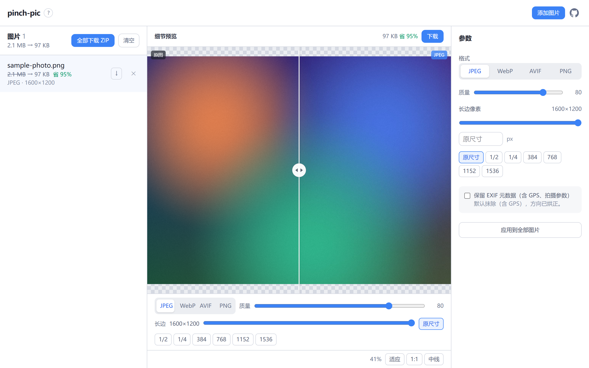

# pinch-pic

浏览器本地批量图片压缩工具：**文件不出本机**。解码、缩放、编码全部在 Web Worker 里由 WASM 完成，
页面只加载静态资源，没有任何上传接口。

在线使用：<https://pinch.cup11.top>



## 功能

- 批量导入：拖拽 / 文件选择 / 剪贴板粘贴（Ctrl+V）
- 输出格式：JPEG（mozjpeg，默认，兼容性最好）、WebP、AVIF、PNG（oxipng 无损优化）
- 有损格式调「质量」（0-100），PNG 调「优化力度」（1-6）
- 「长边像素」等比缩放，只缩不放，空值 = 原尺寸；提供 1/2、1/4 与 384 网格快捷档位
- 每张图片独立参数，可一键「应用到全部图片」
- 细节预览：拖动中线左右对比原图与压缩结果，滚轮／双指缩放、拖拽平移、适应／1:1
- 预览内嵌快捷参数条，右上角实时显示压缩后体积与节省率（省 X% / 增 X%），可直接下载
- 单张下载，或全部打包为 ZIP（JPEG 产物扩展名 `.jpeg`）
- 默认抹除全部元数据（含 GPS），方向信息烘进像素；JPEG 输出可 opt-in 保留 EXIF
- 界面中文；桌面三栏，移动端底部标签栏（图片／预览／参数）

## 浏览器支持

需要 WebAssembly、module Web Worker 与 `OffscreenCanvas`：

| 浏览器 | 版本 |
| --- | --- |
| Chrome / Edge | 91+ |
| Firefox | 90+ |
| Safari | 16.4+ |

AVIF 多线程编码依赖 `SharedArrayBuffer`，仅当页面处于 cross-origin isolated 时才会启用。
本项目的静态部署未开启 COOP/COEP，因此 AVIF 回退单线程，速度较慢但结果一致。

## 本地开发

```bash
pnpm install
pnpm dev        # http://localhost:5173
pnpm check      # svelte-check + tsc
pnpm build      # 输出到 dist/
pnpm preview    # 预览构建产物
```

## 部署

Netlify 静态站，配置见 [netlify.toml](./netlify.toml)：构建命令 `pnpm build`，发布目录 `dist`，
`NODE_VERSION = 22`。

## 工作原理

解码与编码都不经过网络。两路编码共用同一条参数管线（`src/lib/pipeline.ts`），
保证「预览所见」与「产物所得」一致：

- **裁剪预览**：`src/lib/worker/preview.worker.ts`，只编码当前可见区域，150ms 防抖，跟随缩放与平移更新
- **全量编码**：`src/lib/worker/encode.worker.ts`，由 `src/lib/encodePool.ts` 的 Worker 池调度
  （并发 `min(cores-1, 4)`），产出真实体积与可下载产物

WASM 编码器来自 [jSquash](https://github.com/jamsinclair/jSquash)，按格式懒加载，
首次选择某格式时才拉取对应的 `.wasm`。

## 目录结构

```
src/
  App.svelte                 # 布局与断点切换（桌面三栏 / 移动标签栏）
  lib/
    components/              # JobList · PreviewPane · ParamsEditor · ParamPanel · InfoPopover
    stores/jobs.svelte.ts    # 作业队列与参数状态
    worker/                  # preview / encode worker 与消息协议
    codecs/                  # jSquash 适配器（jpeg · webp · avif · png）
    pipeline.ts              # 解码 / 缩放 / 裁剪，两路共用
    encodePool.ts            # 编码 Worker 池
    previewSession.ts        # 预览会话（防抖、丢弃过期结果）
    exif.ts                  # JPEG 元数据保留
    download.ts              # 单张下载与 ZIP 打包
  public/favicon.svg
```

## 已知限制

- 不支持 HEIC/HEIF 输入（仅预留接口）
- PNG 输出为无损优化，本身已经压得很小的 PNG 可能不降反增
- 元数据保留仅适用于 JPEG 输出
- 尚未接入自动化测试

## 文档

- 领域术语与模型：[CONTEXT.md](./CONTEXT.md)
- 关键决策记录：[docs/adr](./docs/adr)
